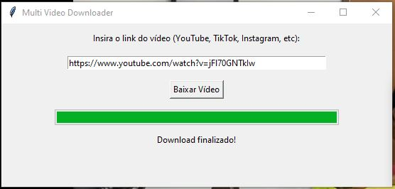
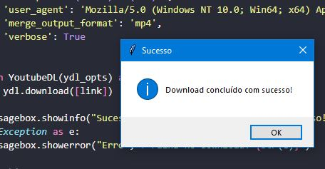
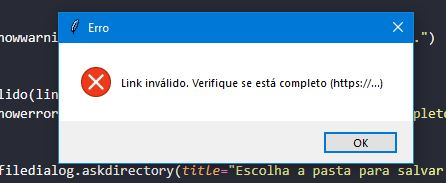

# 📥 Downloader-Video-Py

Um aplicativo simples em **Python** para baixar vídeos do **YouTube** utilizando a biblioteca [Pytube](https://pytube.io/) e interface gráfica com **Tkinter**.

---

## 🚀 Funcionalidades

- Baixar vídeos do YouTube em formato **.mp4**
- Escolher diretório de salvamento
- Interface gráfica simples e intuitiva com Tkinter
- Exibição de mensagens de status (início, progresso e conclusão do download)

---

## 🛠️ Tecnologias utilizadas

- **Python 3.x**
- **Tkinter** (interface gráfica)
- **Pytube** (download de vídeos do YouTube)
- **OS / Sys** (manipulação de diretórios e arquivos)

---

## 📂 Estrutura do Projeto

```
downloader-video-py/
│
├── src/                    # Código-fonte principal.
│   ├── gui/           # Interface gráfica (Tkinter).
│   │   └── principal.py       # Código da janela principal
│   │
│   ├── downloader/    # Lógica de download (Pytube).
│   │   └── downloadtest.py
│   │
│   ├── utils/                   # Funções auxiliares
│   │   └── file_manager.py      # Gerenciamento de diretórios/arquivos.
│  
│
├── tests/                   # Testes automatizados. (pytest/unittest)
│   ├── test_downloader.py
│   └── test_utils.py
│
├── picture/            # Ícones, imagens, logos, etc.
│
├── requirements.txt       # Dependências do projeto.
├── README.md                    # Documentação 
└── .gitignore    # Arquivos/pastas ignorados no Git.

```
### Legenda:

* src/gui/ → interface gráfica com Tkinter.

* src/downloader/ → lógica para baixar vídeos do YouTube (Pytube).

* src/utils/ → funções auxiliares, como verificar caminhos e gerenciar arquivos.

* tests/ → testes unitários para validar o funcionamento.

* assets/ → ícones ou imagens para a interface.

* app.py → ponto inicial que conecta GUI + lógica de download.
---

## ⚙️ Instalação

1. Clone este repositório:

```
git clone https://github.com/seu-usuario/downloader-video-py.git
```
---
 2. Acesse a pasta do projeto:

```
cd downloader-video-py
```
---
3. Crie um ambiente virtual (opcional, mas recomendado):

```
python -m venv venv
source venv/bin/activate   # Linux/Mac
venv\Scripts\activate      # Windows
```
---
4. Instale as dependências:

```
pip install -r requirements.txt
```

▶️ Como usar

1. Execute o programa:

```
python main.py
```
2. Cole a URL do vídeo do YouTube na caixa de texto.

3. Escolha o diretório para salvar o arquivo.
---

## Captura da Tela Principal.

<div align="center">
  
</div>

---

### Mensagem de Download concluído.

<div align="center">
  
</div>

---

### Mensagens de Erro:

<div align="center">
  
</div>

---

<div align="center">
  
</div>

---

## Melhorias a serem implementadas:

* Suporte para download de playlists

* Opção de extrair apenas o áudio (MP3)

* Barra de progresso em tempo real

* Suporte a múltiplos downloads simultâneos

---
## Autor do Projeto

Feito por Saulo de Tarso - Desenvolvedor FullStack Jr 👨‍💻.

GitHub: https://github.com/Saulodtarso06

LinkedIn: https://www.linkedin.com/in/saulo-de-tarso-8a2b00133/